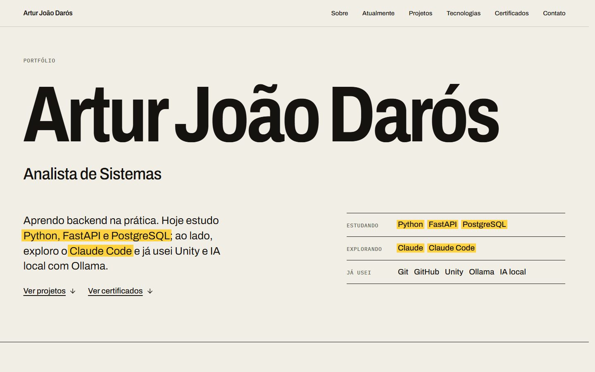

# Portfólio — Artur João Darós

Portfólio de **Artur João Darós**, Analista de Sistemas em formação contínua: o que ele estuda agora (Python, FastAPI, PostgreSQL), o que já explorou (Unity, Ollama, IA local, Claude Code) e os certificados que comprovam o caminho.



- **Site:** https://arturdaros.is-a.dev _(domínio ainda a publicar; ver [docs/deployment.md](docs/deployment.md))_
- **Regra editorial:** nada é inventado. Cada dado sai de uma fonte verificável (briefing do autor ou certificado) e o nível de contato com cada tecnologia é explícito: _estudando_, _explorando_ ou _já usei_.

## O que tem

| Área | Detalhe |
| --- | --- |
| Conteúdo | Hero, Sobre + trajetória, Atualmente, Projetos (+ Unity), Tecnologias, Certificados, Contato, página 404 |
| Certificados | Imagens reais (WebP) com visualizador em tela cheia: `<dialog>` nativo, teclado, zoom em "Tamanho real", funciona no celular |
| SEO | `title`, description, canonical, Open Graph, Twitter Card, JSON-LD (`Person`), `robots.txt`, `sitemap.xml`, `llms.txt`, favicon (SVG, ICO, PNG), manifest |
| Performance | HTML pré-renderizado (SSG) + hidratação, CSS embutido, fontes `latin` pré-carregadas, imagens WebP com dimensões explícitas |
| Acessibilidade | HTML semântico, skip link, foco visível, alvos ≥ 44 px, `prefers-reduced-motion`, contraste AA validado |
| Segurança | CSP estrita, HSTS, `nosniff`, `Referrer-Policy`, `Permissions-Policy`, COOP |
| Observabilidade | Analytics sem cookies (GoatCounter), eventos anônimos, relato de erros de JS, uptime por GitHub Actions |
| Qualidade | oxlint, TypeScript estrito, verificador de `dist/`, Lighthouse CI, Dependabot |

## Stack

Vite 8 · React 19 · TypeScript 6 · CSS Modules · oxlint. Ícones: `lucide-react` (interface) e `simple-icons` (logos). Fontes: Archivo (variável) e IBM Plex Mono, hospedadas no próprio site. `sharp` só no script de certificados. Sem biblioteca de animação, sem router.

## Começando

Requer Node.js ≥ 22.

```bash
cp .env.example .env
npm install
npm run dev        # http://localhost:5173
```

| Script | O que faz |
| --- | --- |
| `npm run dev` | Servidor de desenvolvimento |
| `npm run build` | `tsc` + build do cliente + build SSR + pré-renderização → `dist/` |
| `npm run check` | Confere `dist/`: SEO, arquivos obrigatórios, certificados e ausência de marcas de IA |
| `npm run verify` | `lint` + `build` + `check` (o que o CI roda) |
| `npm run lint` | oxlint |
| `npm run preview` | Serve `dist/` localmente (sem os headers da Vercel) |
| `npm run certs` | Regera as imagens de certificados a partir de `Certifications/` |
| `npm run lighthouse` | Lighthouse CI sobre `dist/` |

## Configuração

Copie [`.env.example`](.env.example) para `.env` (não versionado) e ajuste. Variáveis com prefixo `VITE_`:

| Variável | Uso |
| --- | --- |
| `VITE_SITE_URL` | URL pública, sem barra final. Alimenta canonical, `og:*`, sitemap, robots e llms.txt. Padrão: `https://arturdaros.is-a.dev` |
| `VITE_GOATCOUNTER_CODE` | Código do site no GoatCounter. Vazio = analytics desligado (nenhum script é carregado) |

## Conteúdo

Todo o conteúdo vive em `src/data/`; os componentes só apresentam.

| O quê | Arquivo |
| --- | --- |
| Nome, cargo, e-mail, GitHub, **LinkedIn** | `src/data/site.ts` (LinkedIn vazio = não aparece) |
| Projetos e projetos Unity | `src/data/projects.ts` |
| Tecnologias e nível de contato | `src/data/technologies.ts` |
| Seção "Atualmente" | `src/data/focus.ts` |
| Trajetória (datas e contagens vêm dos certificados) | `src/data/timeline.ts` |
| Certificados | `src/data/certificates.ts` |
| Texto do `llms.txt` | `seo/llms.template.txt` |

Hero, Atualmente, trajetória e tecnologias leem das mesmas fontes: mudar o nível de uma tecnologia atualiza o site inteiro.

### Certificados

Os originais ficam em `Certifications/` (ignorada pelo git). O site só usa o que está na lista `SOURCES` de [`scripts/build-certificates.mjs`](scripts/build-certificates.mjs). Para exibir a imagem de um certificado que hoje é só texto: coloque o original em `Certifications/`, adicione-o em `SOURCES` (mesmo `id` de `certificates.ts`) e rode `npm run certs`. **Só entram certificados emitidos pela instituição; nunca imagens editadas ou geradas por IA** (o `npm run check` procura marcas de geração por IA).

## Qualidade medida

Lighthouse 12 sobre o build de produção (Edge, throttling simulado padrão), servido com Brotli e os headers do `vercel.json`, em `http://localhost`:

| | Performance | Acessibilidade | Boas práticas | SEO | CLS |
| --- | --- | --- | --- | --- | --- |
| Desktop | 99 | 100 | 81¹ | 100 | 0 |
| Mobile | 91 | 100 | 82¹ | 100 | 0,058 |

¹ A única falha é "não usa HTTPS", inevitável em `localhost`; em produção (HTTPS) some. O CI exige performance ≥ 85, acessibilidade e SEO ≥ 95, boas práticas ≥ 80, CLS ≤ 0,1 e TBT ≤ 200 ms (`lighthouserc.json`).

## Publicar e operar

- [Arquitetura](docs/architecture.md): estrutura, pipeline de build e decisões
- [Deploy](docs/deployment.md): Vercel/Netlify, domínio `is-a.dev`, HTTPS
- [Operação](docs/operations.md): analytics, uptime, logs, Lighthouse e resolução de problemas
- [Changelog](CHANGELOG.md)

## Licença

Conteúdo pessoal do autor. Nenhuma licença de reuso foi definida.
